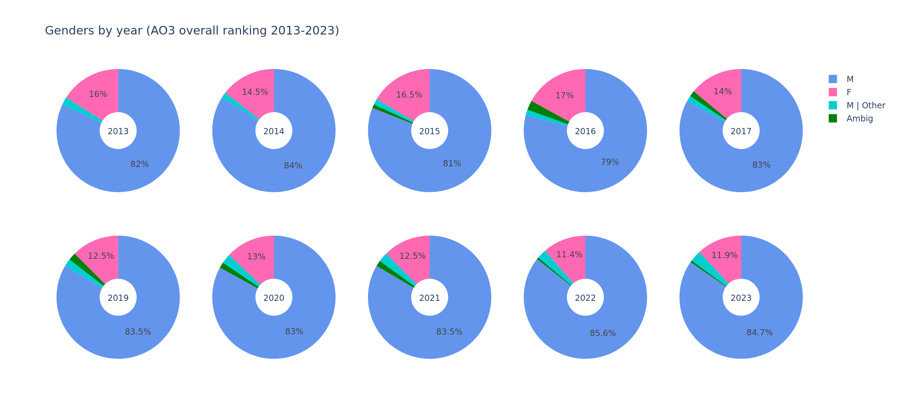
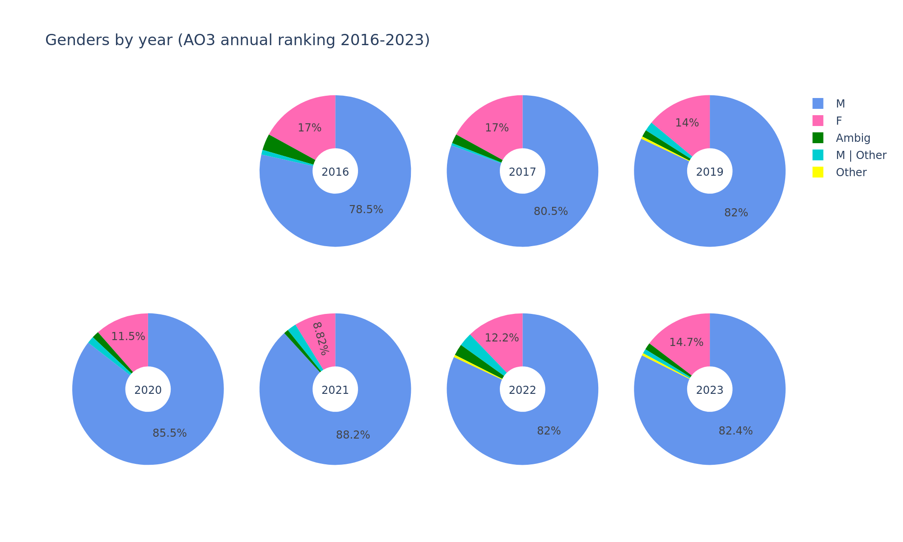
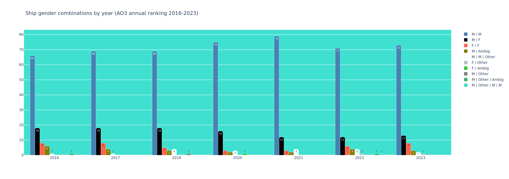
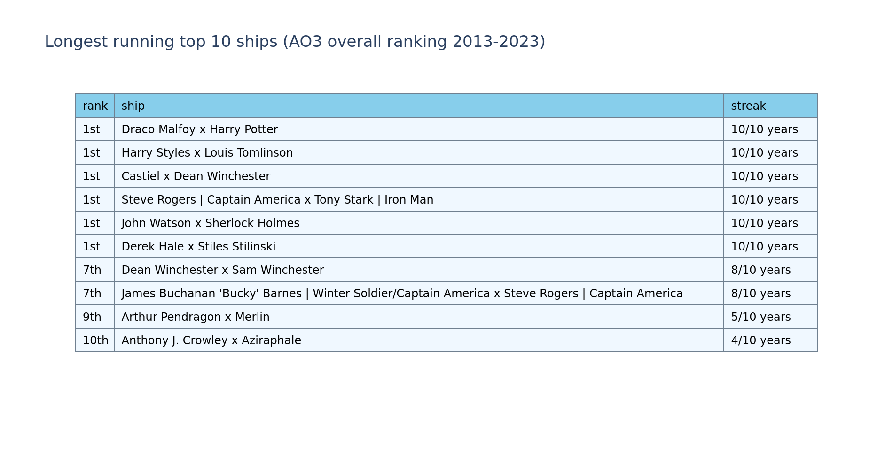
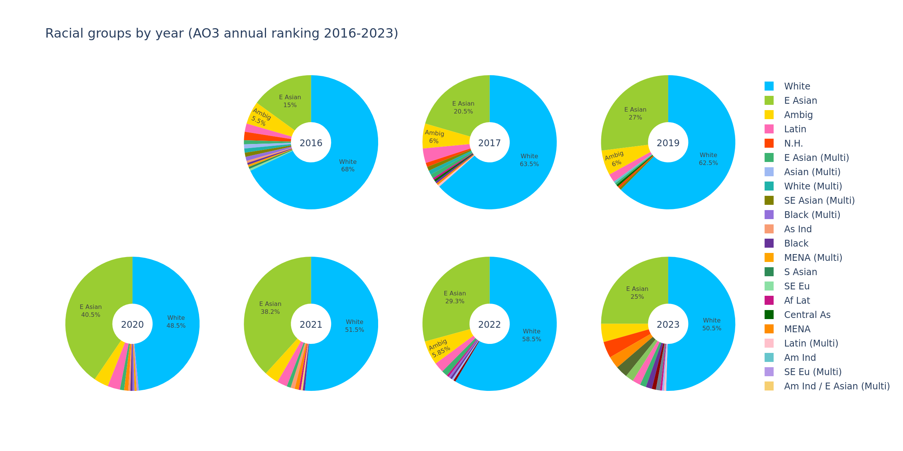
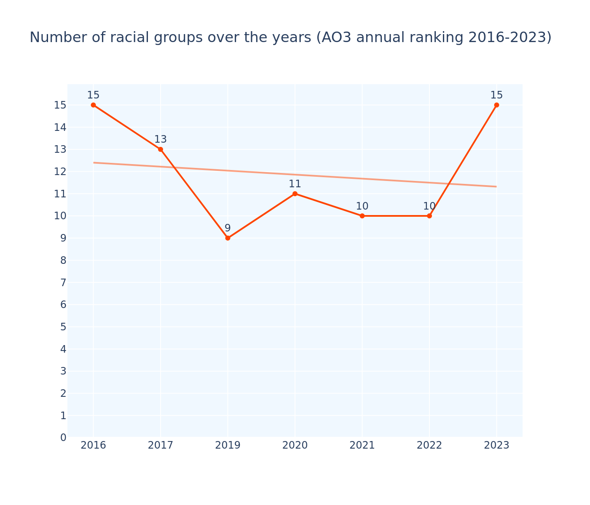
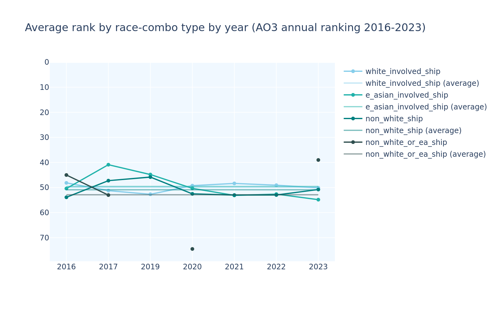
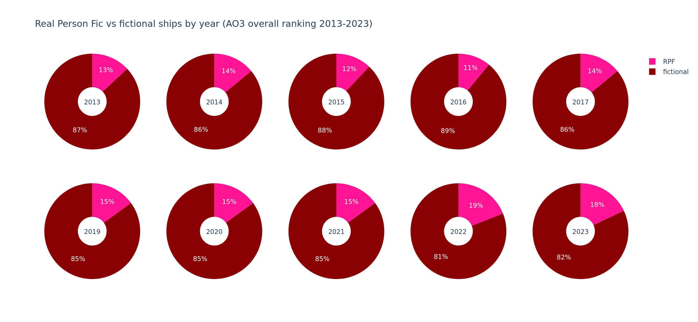
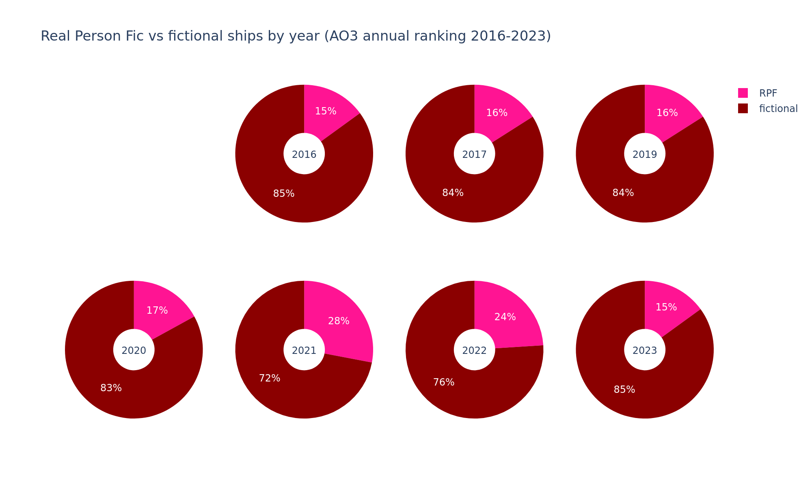

# TLDR:

## Summary

This project looks at the rankings of the most popular pairings (ships) each year on the fanfiction site AO3 [as collected by AO3 user @centreoftheselights (OP)](https://archiveofourown.org/series/3929719) to analyse the demographics of the characters/celebrities that made the ranking and other stats about the interests/preferences of AO3 writers demonstrated by this data, to try and put some numbers and visuals to the trends we tend to see across fandom culture at large.

Fandom creators who make this type of content tend to scew young and female (by an overwhelming majority), and/or have a higher than gen-pop amount of queer and neurodivergent members.
Female-made media tends to be overlooked in general and underrepresented in mainstream media, so looking at fandom content can give unique insights into its tropes, representation, and the psychology of its creators.

## Overarching insights

There are 3 types of ranking data OP collects:
- an overall ranking that ranks the pairings by total number of works available on AO3 that year
- a femslash ranking that only looks at women loving women (wlw) pairings by total number of works
- an annual ranking that ranks the pairings by the number of new works since the previous year

### Gender diversity

The general ranking features predominantly men (consistently over 4/5) and men loving men (mlm) pairings, dwarfing all other categories.
Straight pairings are the second biggest chunk, accounting for a majority of the women represented in the general rankings, but still tend to make up less than 1/3 the number of mlm pairings. 

character gender distribution | ship gender combinations
:-------------------------:|:-------------------------:
 | 
 | 

Less than 10 wlw ships made the general rankings in any year (which is why OP collects a separate femslash ranking). In the overall ranking, no more than 5 ever made it in the same year.

The 10 ships that have stayed in the top 10 of the general rankings the longest, are all-male.

overall | annual
:-------------------------:|:-------------------------:
 | 

### Racial diversity

On all rankings, the biggest ethnic group is white people, which is to be expected to some extent on a largely english-speaking site, with east asians making up the second biggest group, largely due to the increasing, global, mainstream popularity of anime and kpop among other east asian media.

#### Overall ranking

The overall ranking is doing the worst on ethnic diversity with the biggest majority of white people (from over 4/5 down to about 2/3 over the years) and least racial groups represented, only getting worse on the latter over the years (line go down). 

East asian folks' numbers have increased significantly over the time period tracked, as well as climbing in the actual rank numbers to be nearly on par with ships involving white characters. 

All other groups are highly underrepresented in comparison and tend to be ranked lower without a white or east asian partner to raise their rank.

number of racial groups | average rank (w/ & w/out white & east asian characters)
:-------------------------:|:-------------------------:
 | 

#### Femslash ranking

The femslash ranking is doing significantly better on having a smaller (albeit still majority) percentage of white people (between 2/3 and just above 1/2 of the total) and more diversity in its higher, steadily increasing number of racial groups (line go up). 

It also saw some increase in east asian folks over the years, but far less pronounced than in the general ranking. Their average rank numbers also stayed much more stable over time than in the overall ranking. 

Femslash also has significantly more non-human and ambiguous characters, largely due to Homestuck and Steven Universe ships (both of which feature a lot of alien characters and have no live action cast).

number of racial groups | average rank (w/ & w/out white & east asian characters)
:-------------------------:|:-------------------------:
 | 

#### Annual ranking

The annual ranking sees the most fluctuation due to only counting that years' added works. 

Surprisingly its east asian numbers nearly caught up with its white numbers in certain years, like 2020. However both did still squash any other groups similar to the overall ranking.

OP noted that in 2023, the data is scewed by the fact that, due to an AI scare, a lot of people privated or deleted their works (removing them from the scrapeable data), affecting bigger ships' numbers most dramatically. We see this reflected in a reduction of both the white and east asian chunks in favour of smaller racial groups that year.

number of racial groups | average rank (w/ & w/out white & east asian characters)
:-------------------------:|:-------------------------:
 | 

### Other stats!

#### RPF

Real Person Fic (RPF) refers to shipping real life people with each other, like musicians, actors, athletes, or youtubers for example. 

The general rankings have way higher rates of RPF ships than the femslash ranking, due to the wlw RPF largely consisting of women's football, while there is quite a lot of RPF about male youtubers (like Dan and Phil or various minecrafters) and musicians (mostly idols like One Direction or BTS, and emo bands like MCR).

overall | annual | femslash
:-------------------------:|:-------------------------:|:-------------------------:
 |  | 

<!-- 
#### Non-slash fic

Slash fic focuses on romance or sexual relations between the characters involved ("They should kiss!"), while general fic focuses on other kinds of relationships, like friendship or family relations instead.
 -->
