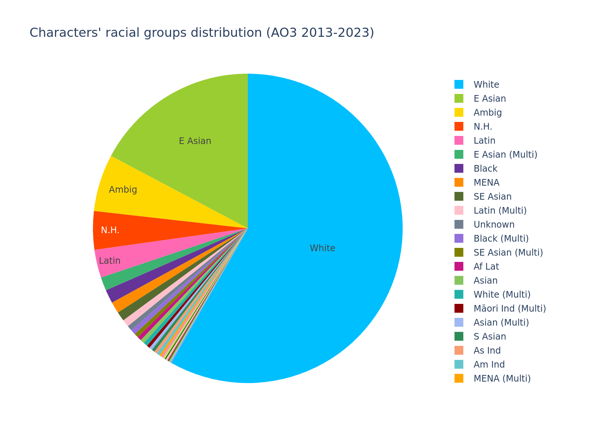
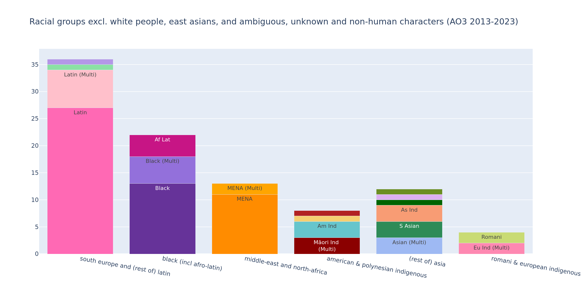
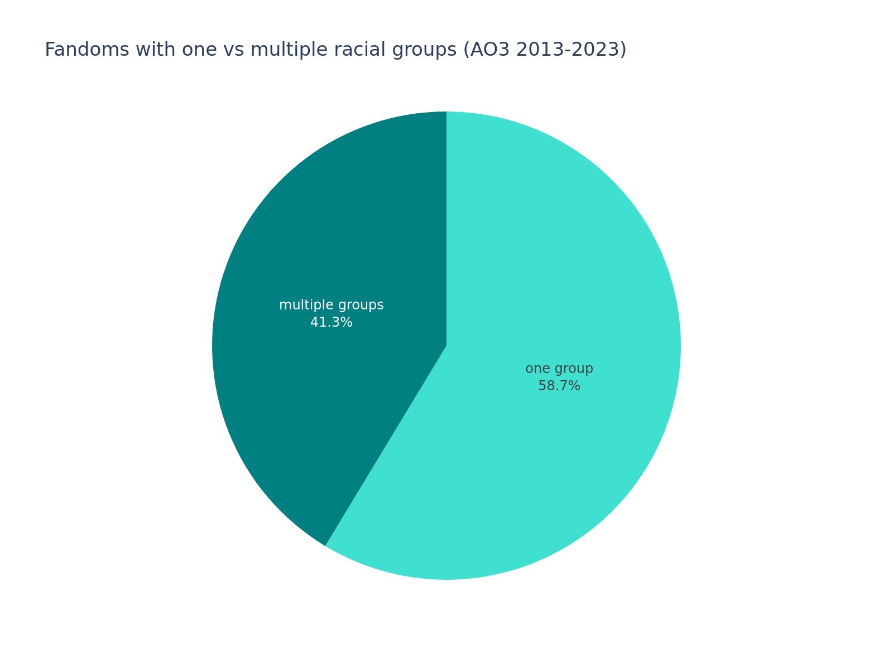

# Looking at all unique characters and ships thereof contained in all the AO3 data sets between 2013 and 2023

## Overview

A total of 922 characters across 600 unique ships made the AO3 rankings between 2013 and 2023.

### Fandom Market Share

These are the fandoms that accounted for the most ships:

Marvel leads the pack with 33 ships, followed by Youtube with 24 and the Harry Potter Universe with 21.

### RPF

13% of total ships were Real Person Fic while 87% were of fictional characters.

### Hottest Characters

These are the characters who were in the most ships in their fandom (with a minimum of 3 ships to qualify):

Minecraft youtuber TommyInnit leads overall with 8 ships (out of 24 Youtube ships), followed by Tony Stark with 7 (out of 33 Marvel ships), and Sam Winchester from Supernatural and The Doctor from Doctor Who with 6 respectively.

## Gender statistics

### Characters

This is the overall gender distribution:

It is currently scewed by the fact that one of out usually 3 rankings each year is exclusively femslash, inflating the number of female characters in the overall set. This number will be decimated once we look at the actual co-ed, yearly rankings.
However even with these inflated numbers, male characters still solidly outnumber female ones.

These are the numbers for any gender tags other than straight up "M" and "F":

"M | Other" was represented by exactly 5 characters/people. All of the fictional ones are some variety of deity or otherwise celestial being. 
All but one of "F | Other" were (alien) Gem characters from Steven Universe. 

The only two unaligned nonbinary characters in the set are the canon nonbinary character from Owl House, and the Venom Symbiote. (Yes, the goop. The Venom goop.)
All of the drag queens represented explicitly use she/her in drag and he/him (x3) or he/they (x1) out of drag (at time of data collection).

All of these are out-numbered by ambiguously-gendered self-insert characters like player characters and "x Reader".

There are no (binary(-aligned) or explicitly medically) trans characters in the set, as (as far as I can find on the wiki) the Owl House nonbinary one does not have in-universe transition portrayed or birth assignment specified (they are voiced by transmasc nonbinary actors). This is in spite of canon trans characters and real life trans people, who didn't make the ranking, existing (some of whom even have canon love interests) in the fandoms represented, like in DC's Supergirl, My Hero Academia, RuPaul's Drag Race, One Piece, Marvel Comics, Heartstopper, etc.
There are no explicitly intersex characters/people represented either (as far as I'm aware).

### Ships Overview

As for ship gender combinations, men loving men outnumbers any other type, even with the inclusion of, again, one whole ranking (of the three total) per year with ONLY women loving women ships:

Straight ships are outnumbered by both same-sex categories, although, once again, I expect this to change once we look at the co-ed rankings without the femslash bump, with straight ships likely out-numbering wlw ships there.

Taking out straight up mlm, wlw, and het ships, these combinations are left:

Although there are less "M | Other" characters than "F | Other", they account for almost the same amount of ships as each other, likely due to the male-aligned characters/people not being shipped with each other (like the Crystal Gems) and spanning more fandoms (5 rather than 2), leading to a wider spread of ships.

Our "Other" characters are shipped with characters of opposite genders, providing balance to their (small) contribution. The singular canon-nonbinary non-goop character is shipped with their canon ex-partner.

In the ambiguous stack, the vast majority is men (and male-aligned folks) being shipped with ambiguous characters (ie self-inserts).

### Ships per fandom

This is the average number of ships of the given type per fandom:

These are the fandoms with the most ships of the given type:

Marvel (as the fandom with the most ships) has ranked second for all of them.
Youtube is the fandom with the most mlm ships, as the only woman that made it into its 24 ships is the real life wife of the guy she's being shipped with.

This chart shows the number of fandoms that either do not contain any ships of this type, consist exclusively of ships of this type, or where over half of the fandom's ships are of this type.

The only two (2) fandoms (with multiple ship types) that have more than 50% straight ships are Game of Thrones and Doctor Who, so congrats to them on having the best-written hets and the least homoeroticism in media apparently. 👏

## Race statistics

### Characters

This is the total distribution of racial groups among the characters:

White folks vastly outnumber any other racial group.
East asians are the next-biggest portion, followed by ambiguous and non-human characters.

These are the smaller groups without the white, east asian, and un-specified or non-human chunks:

Latin folks make up the largest portion, followed by black folks.
All other groups have less than 15 characters in the entire (922 character) set.
There are more indigenous folks in the set than there are south asians.

### Ships

This chart shows the number of ships with at least one white person, with at least one east asian person, non-white ships, and ships without white or east asian people:

I call the last one of those "The Big Oof" as there were only 22 ships (out of the 600 total) that didn't contain any white or east asian people.

This is the ratio of interracial, non-interracial and ambiguous ships:

Most ships are explicitly between people of the same racial group.

### Fandoms

These last two diagrams show the amount of racial groups per fandom. 

The first one shows how many fandoms only have one racial group and how many have multiple:

It is more balanced than the interracial figure, pointing to there being a number of fandoms where there are multiple racial groups overall but several characters are only being shipped with characters of their own group.

The second diagram shows the fandoms with the highest number of different racial groups:

Marvel once again leads with 8 groups (due to its overall higher numbers of characters/ships). It is followed by The 100 and DC tied for second with 7 groups each, and Star Wars in third with 6. Teen Wolf and Genshin Impact follow in fourth with 5 groups respectively. All other fandoms had less than 5 racial groups represented.