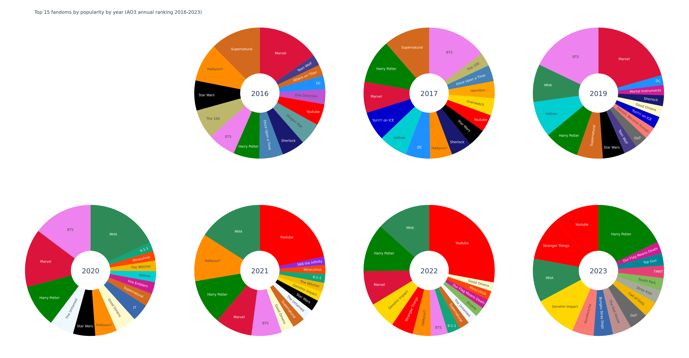
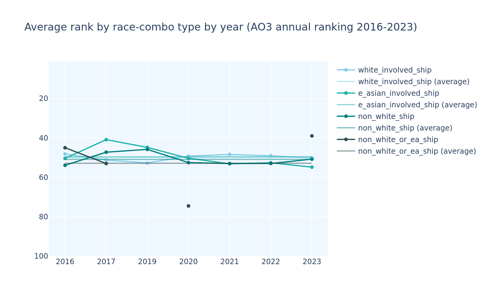

# annual ranking data 2016-2023 

- Ranking based on the difference between the overall number of works of ships between each year and its prior one according to OP's data collection. They also only started collecting this data in 2016.
- Because this is the annual ranking, and only counts a single year's number of works rather than the total, it is much more prone to fluctuation and more reflective of short-term trends than the overall & femslash rankings.
- OP noted that 2023 numbers are somewhat scewed due to a lot of people deleting or privating works because of an AI scraping scare, causing notably popular pairings to show lower numbers than one may expect. This will be seen most severely in this ranking as it is based on the difference between available works rather than actual new works that year, rendering it susceptible to the huge number of deletions and privating.

## General stats

### Top fandoms

<!-- review this one, compare to femslash approach idk -->

These are the fandoms that accounted for the most ships in the annual ranking each year.

Marvel once again stayed in the most numerous fandoms for all years except for 2023 (where it likely dropped out due to its size along with other big fandoms), albeit at wildly fluctuating ranks therein, ranking number 1 in 2016 and 2019.

Supernatural and Star Wars shared its fate, staying in the biggest fandoms for all years except for 2023.

Harry Potter and BTS made it every year, including 2023.

Youtube only didn't make it in 2019 and 2020. MHA made it every year since 2019. Haikyuu!! only didn't make it in 2019 and 2023.

Fandoms that made it for three consecutive years include: Good Omens, Voltron, The 100, Genshin Impact, 9-1-1, Sherlock, and DC.

These are the fandoms that were the most popular when weighted for their rank, ie the higher the rank of a ship the more points it got and then the points of all the ships in the fandom were added together.

Marvel, similarly to its numbers ranked first in 2016 and 2019 and only dropped off the top 15 for popularity in 2023.

Supernatural placed second for 2016 and 2017, dropped off in rank afterwards and dropped off entirely in 2023 again.

BTS ranked first in 2017, and second in 2019 and 2020. It dropped off the popularity top 15 in 2023 as well.

MHA entered the top 15 in 2019, ranked first in 2020, and second in 2021 and 2022, and only dropped to 4th in 2023.

Youtube ranked low in the top 15 in 2016 and 2017, and only resurfaced in 2021 to immediately take 1st place by a huge margin, which only grew in 2022, and only dropped to 2nd place in 2023.

Harry Potter stayed in the top 15 during all years, fluctuating in ranks, and rising to 1st place in 2023.

Star Wars stayed in the top 15 until 2021.
Haikyuu!! only dropped off the top 15 in 2019 and 2023.
Good Omens stayed in the top 15 for 4 years between 2019 and 2022.

Fandoms that stayed in the top 15 for 3 consecutive years include: Sherlock, Voltron, DC, The Untamed, Miraculous, and Genshin Impact.

Another recent addition is Stranger Things which entered the top 15 in 2022, and rose to 3rd place in 2023.

These are the top 5 fandoms by market share and popularity each year.

### Top ships

These are the ships that have made the top 10 both the most times and the longest in a row.

They are the same ships, but the top ones are in a different order between amount of appearances and longest streak, meaning Destiel specifically must've dropped off the top 10 at some point, separating its longest 3 year streak from the remaining 2 appearances.

All of these are mlm ships once again, with only Crowley, as a shapeshifter, having a different gender tag from the others, the same as on the overall ranking.

However unlike in the overall ranking, not all the ships in this top 10 are white/white. 5 of the characters involved are east asian. The rest are still white. There are still no other racial groups represented.

We also have two non-slash ships that made the list, both involving TommyInnit and Wilbur Soot, of the minecrafters.

You can see the [full diagram of top 10 ships each year here.](ao3_annual_rankings_charts/annual_top_ships_2016_2023.png)

#### By gender combination

These are the top 10 mlm, wlw, and straight ships.

Across all three categories, there seems to more racial diversity than in the overall ranking, but most characters are still white. Most interracial and ambiguous pairings also still have a white member, but there are at least some that do not, namely: 
Alexander Hamilton and Eliza Schuyler from Hamilton, 
Allura and Shiro, Keith and Lance, and Keith and Shiro from Voltron, 
Katara and Zuko, and Asami Sato and Katara from ATLA, 
Ava Silver and Sister Beatrice from Warrior Nun.

##### women loving women ships

While all years still had less than 10 wlw ships that made the ranking, some years have about double the amount of femslash ships compared to the overall ranking, with a maximum of 8 ships that made it in 3 separate years, namely 2016, 2017, and 2023.

Clexa from The 100 and SwanQueen from Once Upon a Time were only in the annual ranking until 2019.
The latter show ended in 2018.

Supergirl ships made it every year until dropping off in 2023. 
Cat Grant and Supergirl were the first that made it in 2016.
Supergirl and Lena Luther, and Alex Danvers and Maggie Sawyer joined and overtook it in 2017.
Supergirl and Lena Luther were highest ranking since joining, becoming the only remaining Supergirl ship in 2020. 

Adora and Catra from She-Ra made the ranking in 2020 and only dropped off in 2023.

Amity and Luz from The Owl House (2020-2023) made it in 2021 and stayed on the ranking since.

Arcane (2021-) and Stranger Things ships joined in 2022, and Wednesday (2022-)'s Enid and Wednesday made first rank of the annual wlw ships in 2023.

A lot of these latter ones that are from newer shows seem to make the ranking the year after the show releases.

##### straight ships

The only east asian/east asian ship that ever made the top 10 of straight ships is Deku and Uraraka from MHA, who made 10th place in 2020.
There are only 4 non-white ships that made the annual top 10 straight ships over the period tracked, and one of them involves an ambiguous character (Allura from Voltron).

Only three of the twelve interracial and ambiguous ships that involve white characters have a white woman (namely Clarke Griffin from The 100, Jyn Erso from Rogue One, Ellie from The Last of Us), in all others the white character is the man.
All four of the white/east asian (including east asian multiracial folks') ships are made of a white man and an east asian woman. 

Chat Noir and Ladybug from Miraculous have led the ranking every year except 2019, 2020, and 2023. 
They were dethroned by Reylo shooting to the top in 2019 due to being canonised in The Rise of Skywalker (2019), but only dropped to second place for those two years.
Reylo had previously made the top 10 in 2016, between their first (2015) and second (2017) movie before dropping back off in 2017. Cassian and Jyn from Rogue One (2016) made the top 10 in 2017.

Harry Potter ships increased in the annual straight ships ranking the most, going from 0 ships in 2016, to 4 in 2021 and 2022, only dropping in number but increasing in rank in 2023 with Draco and Hermione ranking as the highest straight ship.

Marvel's Tony and Pepper made the top 10 almost every year tracked, with the exception of 2017, and dropping off the top 10 in 2022 again.

Once Upon a Time's two straight top 10 ships dropped off in 2019, the same as their femslash ship, likely because their show ended in 2018.

##### men loving men ships

The only year that was all white was 2016. 2020 and 2021 only had (non-interracial,) white and east asian ships.
Mlm has by far the highest number of east asian/east asian ships out of the three categories (6 ships vs 2 and 1 respectively).

<!-- to be finished -->

### RPF

This is the RPF to non-RPF ratio for each year.

Generally the RPF percentage hovers around the same as in the overall ranking, but in 2021 it shot up significantly and stayed higher than usual in 2022. This is likely due to the minecrafters entering the rankings that year with a number of ships.

Most of the ships causing higher numbers were M/M. However the straight ship (Philza and his wife) and the triple ship involving a male-leaning person (namely Ranboo) that made the ranking in 2022 also came from the minecrafters.

### Non-slash ships

Slash ships are explicitly romantic/sexual, while general ships explore other types of relationships like friendships or family relations instead. Some general ships actually made the ranking so OP made sure to differentiate them as such.

This is the slash to non-slash ratio for each year.

There was not a lot of general fic in the annual ranking (about similar levels as in the overall one) until the minecrafters' appearance in 2021. The higher percent has been sustained since then, only dropping by 2 percent points each year.

The general fic is also more gender diverse, with not only several straight ships making the ranking over the years, but even an F/F ship making it in 2016 (namely Clexa's general version). The vast majority of it is still M/M though.

## Gender stats

### Gender distribution

This is the gender distribution of characters that made the annual ranking each year:

It is once again around 4/5 male (similar to overall), even growing to over 88% male in 2021 (worse than overall).

While the gender diversity from the femslash ranking didn't make this general ranking either, two "Other" characters did, namely Venom (the goop) and the canon nonbinary character from Owl House.

There are also more different gender combinations than in the overall ranking. 

There are more femslash ships and slightly less straight ones (in 2016, the overall ranking had almost half as many straight ships as mlm ones, while the annual ranking had less than a third).

### Gender minorities

Between Loki (2021-) bringing back Loki ships, the minecrafters, and Good Omens' ongoing popularity, M | Other saw a spike in 2022. 

Dragon Age player characters, alongside x Reader ships for Sans Undertale, Dean Winchester, and Loki, caused the spike in ambiguously gendered characters in 2016. Dragon Age dropped off the annual ranking entirely the next year, reducing their number significantly, leaving only Dean and Sans' x Reader ships and their new addition of Bucky (from Marvel) and Sam Winchester. 

Their next spike in 2022 is caused by two Genshin player character ships and x Reader ships for Bucky and Loki, as well as Eddie Munson from Stranger Things.

Other characters only made it in three years, and it was only ever one of them at a time.

F/F ships dropped significantly around the pandemic lockdown period as did M / Ambig ships.

Loki x Reader is the only M | Other / Ambig ship. It only made the ranking in 2016 (pre-Ragnarok) and 2022 (post-Loki TV show).

In 2019 the Other-involved ship was Eddie Brock and Venom, as it is M / Other.
The 2022 and 2023 Other appearances are the Owl House ship between canon love interests Eda Clawthorne and Raine Whispers (F / Other).

The F / Ambig ship that made it in 2020 is between Edelgard and the player character from Fire Emblem: Three Houses (2019)

### Average ranks

Male characters once again hover around the midway point due to their prevalence, with their average sitting slightly above it.
Female characters still rank lower but by a smaller margin than on the overall ranking.

Once again the M | Other line fluctuated wildly over the years. In 2017 it was determined by Gerard Way alone at rank 81. After that it quickly rose back to over the halfway point ultimately ranking very high in 2023 due to Crowley and Dream from Sandman both ranking in the high teens and none of the other M | Other entries making it. The all time average still ranks around the halfway point.

Other characters had few entries but on average ranked lower than all other gender tags represented.

Ambiguous characters once again ranked lower than men and women by a margin, but did outrank the two Other characters.

Mlm ships ranked higher than men in general on average once again, due to lower ranked straight ships.

Femslash actually ranked higher on average than straight ships in the annual ranking, unlike in the overall. 
Wlw ships were way higher ranked in 2020 and 2021 when their number was at their lowest, indicating that the few popular ships that managed to make it in those years stayed due to being higher ranked ships in general, while the ones that dropped off were much lower ranked, and usually dragged the average down.

Mlm ships with a M | Other member once again fluctuated highly due to their low number but on average ranked higher than regular mlm, by a significantly bigger margin than that in the overall ranking.

M / Ambig ships ranked lower than mlm, wlw and straight ships, but still outranked all the less-often represented combinations like Other-involved ships and any other combination involving an ambiguous partner. M | Other / Ambig did the worst, as, again, it is represented by Loki x Reader alone, which barely made it even in the years it was represented.

## Race stats

### Racial groups

These are the racial groups represented each year.

White characters still make up the biggest chunk, as in all the other rankings, but the annual ranking has a way higher number of east asian characters, climbing to over 1/4 of the total in 2019 and peaking in 2020 and 2021, when they made up about 2/5 of the total, pushing white characters down to UNDER half in 2020 for the first time in any of these rankings!

In 2023, due to the scewed data removing popular ships, we can see that the white and east asian chunks both lost a significant bit, making more space for a variety of other racial groups.

The annual ranking has more characters of less represented racial groups than the overall did. 
MENA and (non-east) asian characters saw a significant increase with the 2023 purge, due to more Genshin ships making the ranking and the 2022 thai, mafia-themed BL drama KinnPorsche entering the ring.
Before that (non-east) asian numbers were on a downward trend.
Black and Indigenous numbers increased over the last few years.
Latin characters are the largest of the minority groups, the same as on the other rankings.

The annual ranking also has a higher number of racial groups than the overall, with once again, a significant increase seen in 2023 when less white and east asian characters were represented, pointing to ships of those groups not only being most numerous but generally part of larger/more popular fandoms or bigger/more popular themselves, hence being most affected by the number of deleted/privated works.

#### Multiracial characters

This is the amount of multiracial characters represented each year.

Multiracial characters fluctuated a lot over the years tracked, reaching their lowest in 2019, but trending upwards again since then.

### Racial combinations

These are the racial combinations of ships over the years.

White-only and east asian-only ships once again consistently make up the two largest groups, with white/ambiguous pairings in third for the entire period tracked. 
Since 2020, white pairings have consistently stayed under half of the total, with east asian pairings nearly matching their number in 2020 and 2021. 

White/ambiguous pairings saw a big increase in 2022, likely in part due to Kaeya from Genshin Impact's ships tripling (from 1 to 3).
Other notable combinations seem to be east asian/white ships (in 2017 and 2019) and latin/white ships (in 2021 and 2022).

#### Interracial ships

These diagrams show the number of interracial ships.

The number of interracial ships is once again lower than in femslash, but bigger than in overall (ca 16% compared to ca 12%).

It still doesn't make for much less of a gap between non-interracial and other ships.

#### Ships involving multiracial characters

Ships involving multiracial characters roughly reflect the number of multiracial characters present.

#### Ships with and without white and east asian characters

This is the number of ships involving at least one white character, involving at least one east asian character, not involving any white characters, and not involving white or east asian characters.

While the annual ranking has the most sizeable portion of east asian involved ships of all the rankings so far (including dragging up the non-white ship ratio via largely east asian-only ships), it does not have very many non-white and non-east asian involved pairings.

The largest increase in the latter is in 2023, when smaller racial groups saw a general increase and we gained several MENA-only (from Genshin) and SEA-only (from KinnPorsche) ships, raising the non-white bar above the east asian involved one for the first time ever.

2019, 2021 and 2022 didn't have any pairings that didn't involve white, east asian, non-human, ambiguous or unknown members.

This figure shows the average rank that each category had each year.

Strangely enough, unlike in *all other rankings*, in the annual ranking all categories' averages ranks very closely to each other, around the midway point. 
The white-involved and east-asian-involved average lines seem to be straight up overlapping. Non-white ships are only marginally lower ranked, which one may be able to attribute to them being made up of largely east asian/east asian ships, but even the rare non-white and non-EA ships, when present, only rank marginally lower on average than the other categories.

Where in other rankings there was a clear differentiation in average rank based on whether white and/or east asian characters were involved, this does not seem to be the case in the annual ranking. 
It seems to merely influence what number of them is represented in the first place.

This makes sense as a ranking with much more fluctuation and less baggage (due to lack of counting prior years' popularity) would have more flexibility to allow for any kind of pairing to be highly popular in a given year. In more stagnant rankings, previous years' racist omissions and lack of representation in media at large will reflect in the numbers for longer.

It may also indicate that non-white/non-east asian pairings, while having the ability to be equally popular during a given year, are not being engaged with as ferociously for as long by fan creators (ie they're dropped faster than longterm bigger ships), preventing them from making it higher on the overall ranking with time.

You can see the [full tables for the top 3 ships of each category by year here.](ao3_annual_rankings_charts/annual_race_stats/annual_non_white_top_ships_2016_2023.png)

## Conclusions and theories

### Timing

New media and events in existing media seem to take about a year to reach the annual ranking. I will need to gather more indepth data to compare for this, but from the few pieces of recent media that ranked high and I looked up release dates for, this seems to be the trend. 

Obviously older fandoms, due to their size and having lasted this long, seem to sustain a baseline growth even when no new media is being added to their canon (ex Why Are There So Many Harry Potter Ships In Here??? Why Are There Lesbians That Have Never Actually Appeared Outside Of Pottermore In The Ranking???).

Ships can and will often drop in ranks (aka have less new works written about them) when their media is not as active or has ended. 
Examples include Once Upon a Time and others dropping off the annual ranking the year after their show ended, 
or Loki only resurfacing the year after his new show started, with his x Reader ship and a ship with Mobius from said show, in lieu of older ships like Thorki and Frostiron that still lasted in the overall ranking by resting on old lorels.

### Pandemic coping via escapism

The dip in both women and racial diversity in favour of an increase in east asian mlm ships around the time of the pandemic seems like an indication of the writers' means of coping. 

One of the theories/factors for why women are so obsessed with mlm shipping is that they like the absence of women from the romance. Between straightness/gender roles and society's sexualisation of women, they, as a group, have too much trauma around the subject of sex and relationships to be able to fully enjoy romance that involves women. Mlm stories allow them to enjoy romance without needing to feel involved themselves.

It would make sense that they'd use mlm shipping as a means of escapism more so than usual during a traumatic time with too much time on their hands like the pandemic lockdown.

I also suspect that the increased interest in specifically east asian characters during those years might come from white/western creators using that extra step of otherness as another level of removal from their own situation at the time, further serving the escapism. 

A lot of the characters in question are also anime characters, meaning the animated aspect could serve the same purpose, over more commonly live action western ships.

The rest seem to mostly be kpop idols (including ships from other boy groups than just BTS, like Stray Kids, EXO, and NCT, making the ranking) a lot of whom were still producing content for a decent portion of the pandemic as a lot of them were able to isolate as a group, similarly to what was attempted with sports teams at the time.

### The minecrafters were a big deal apparently

The minecraft youtubers/streamers around the Dream SMP saw a meteoric rise around 2021, a year after the SMP started. (This aligns with other media whose popularity reflected in the ranking around a year after release date.)

The intensity of their rise in popularity is likely also to do with the pandemic due to the timing. (I believe I read on a wiki that they made the SMP server specifically to play on during the pandemic.)

They are also interesting in the sense that a lot of their ships are not slash ships, going against the general trend on all of these rankings usually.
One would think that if their popularity was due to the girlies coping and them being the boys in the right place at the right time to be swept up in that trend, there would be more slash shipping involved.

My best guess is that, despite my counting them as RPF, because their SMP content (to my understanding) was narrative role playing rather than variety or let's play content like you see from the idols or other youtubers being RPF-shipped, people must've been interested enough in the narrative they were weaving to focus on that and the group's friendship, rather than only slash shipping specific pairings (which they seem to also very much have done, don't get me wrong).

### Why is Harry Potter still here

The Harry Potter movies concluded in 2011, with only the much less popular Fantastic Beasts movies, stage play, and occasional controversial game contributing new media to the franchise at this point. 

Its creator came out as a militant transphobe in 2020, and has shown no sign of remorse and only dug herself deeper into bigotry and her own insanity since, to the point of being sued for online bullying by an androgynous cis woman, from a country where being trans literally lands you in prison not in the Olympics, as I am typing this.

Why on earth is this fandom still in here? Why on earth is it still ranking as highly as various of these metrics indicate?

"Well maybe it's the Fantastic Beasts ships or something from the game that made the ranking? Wasn't the latest movie released in 2022?"

Nope! All the most popular ships are old-head shit like Drarry or the marauders. There is a femslash pairing that has literally never appeared in any media outside of Pottermore from what I gather. 
The canon gays Dumbledore and Grindelwald didn't even MAKE the data set. They cast them with Jude Law and Johnny Depp/Mads Mikkelson respectively *AND FOR WHAT!!*

The Harry Potter fandom has been consistently represented through the entire period tracked.
In the annual ranking, its popularity didn't really see much change throughout the years. 
There seems to have been a slight popularity increase in 2020, but also things were crazy during the pandemic, so who's to say what caused it. Either way, there definitely wasn't a significant drop caused by JKR's transphobia. 

I think HP as a fandom has been coasting by on size alone since the movies finished in 2011, and JKR's controversy since 2020 stirred some people to go back to writing HP fanfic rather than boycotting the franchise, but I think a lot of people had already kinda given up on it many many years ago and what we're seeing in here are the continued dregs of one of the biggest western fandoms ever.

This theory is supported by HP being the only major fandom seemingly more than unaffected by the 2023 purge, rising to first spot in popularity that year while other major, traditional fandoms like Marvel and Supernatural dropped off the top 15 most popular fandoms entirely that year.
People who used to write HP fanfic clearly didn't care as much to protect it from AI as people in other big fandoms did, which would point to most of them having abandonned ship already.

People no longer caring about HP content would also be supported by, again, the twitter-canon gay pairing that meanwhile got a several-movie-long live action adaptation, cast with The Type Of White Guy That Tends To Make This Ranking, not making it into, not only any one ranking, but *this ENTIRE DATA SET*.