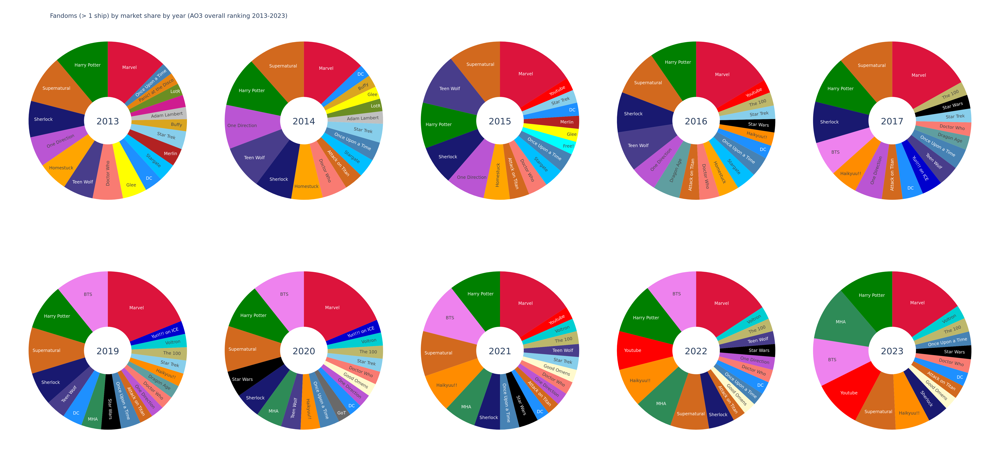
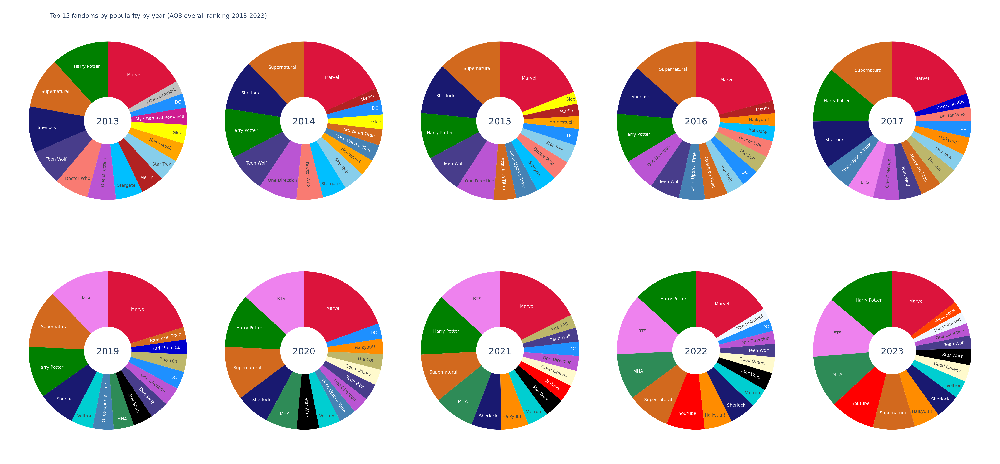
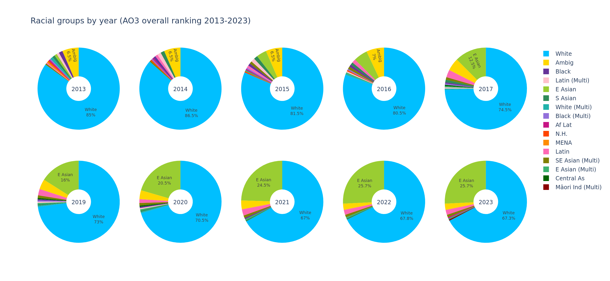
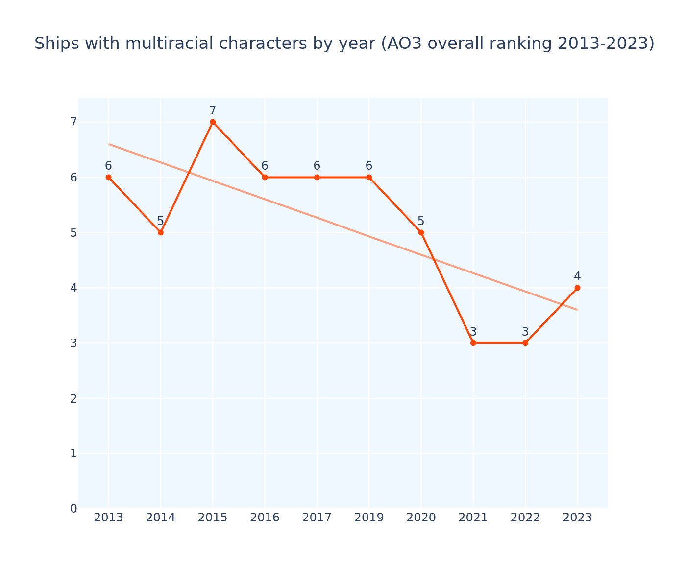

# overall ranking data 2013-2023 

- Ranking based on the all-time total number of overall works available on AO3 at time of OP's data collection
- OP noted that 2023 numbers are somewhat scewed due to a lot of people deleting or privating works because of an AI scraping scare, causing notably popular pairings to show lower numbers than one may expect. However this should be less of an issue for our all-time (general or femslash) rankings than for the yearly (general) one we have yet to look at.

## General stats

### Top fandoms

<!-- review this one, compare to femslash approach idk -->

These are the fandoms that accounted for the most ships in the overall ranking each year.

Marvel has been the biggest fandom every year. 
Harry Potter stayed in the top 4 for the entire time as well. 
Sherlock stayed in the top 5 and Supernatural in the top 3 until 2020 (the year the latter ended). 
Teen Wolf made the top 5 between 2014 and 2016, peaking as the third biggest fandom of 2015. 
One Direction was in the top 6 until 2017, when BTS entered the fray and rose to 2nd biggest fandom in the next tracked year (2019) and stayed there until 2022 when it fell to 3rd place and even further in 2023, likely due to other male kpop groups like NCT, SEVENTEEN or STRAY KIDS rising to start and rival BTS in global popularity in recent years. 
MHA made the chart since 2019 as well, entering the top 5 in 2022 and rising to 3rd biggest fandom in 2023.

These are the fandoms that were the most popular when weighted for their rank, ie the higher the rank of a ship the more points it got and then the points of all the ships in the fandom were added together.

Marvel is still leading the ranking every year. 
Supernatural stayed in 2nd place between 2014 and 2017, bumpered by 3rd place in 2013 and 2019, dropped to 4th place in 2020 and 2021, and still made the top 6 in the following two years. 
Sherlock remained hot on its heels, with 4th place in 2013 and 2017, 3rd place between 2014 and 2016, and 5th place in 2019 and 2020, and still making the top 8 since. 
Johnlock and Destiel were the top 2 ships for the entire period tracked, so we likely lost some lower ranked ships in these fandoms but retained a high popularity score for them due to the remaining ships being very high ranked over the years.
Harry Potter stayed in the top 4 for the entire period tracked.
BTS stayed in 2nd place from 2019 to 2021, only dropping by one place to 3rd place for 2022 and 2023.
MHA made 4th place in both 2022 and 2023 after climbing the ranks over the prior years.
Youtube entered the top 15 in 2021 and climbed steadily since. 

These are the top 5 fandoms by market share and popularity each year.

### Top ships

These are the ships that have made the top 10 both the most times and the longest in a row.

Not a single woman made the top 10 during any year, let alone the longest running ones. 
All other ships were mlm, with only Crowley from Good Omens providing gender diversity as a male-aligned shapeshifter. (He is played by David Tennant.)
All of the longest running ships are white/white. 
What we do have among these 10 longest running ships is an RPF ship (Harry Styles and Louis Tomlinson from One Direction), and a blood-related-incest ship (The Winchester brothers from Supernatural).

You can see the [full diagram of top 10 ships each year here.](ao3_overall_rankings_charts/overall_top_ships_2013_2023.png)

With the exception of Blaine and Kurt from Glee, Keith and Lance from Voltron, Yuri and Victor from Yuri on ICE!!, Jungkook and V from BTS, and Bakugo and Deku from MHA, all of these ships were white/white. Two of the others still involve one white character, and 5 of the remaining characters/people in those ships are east asian.
They also once again were all mlm, with only Crowley being tagged something other than just "M".

#### By gender combination

These are the top 10 mlm, wlw, and straight ships.

##### women loving women ships

No more than 5 wlw ships ever made the overall ranking in any year, with only 2023 actually having 5. 

Most of the wlw ships were white/white or at least involved one white character, but by far not as many as the mlm ones. 

SwanQueen from Once Upon a Time made it every year, staying in the top two after being dethroned from first place by SuperCorp from Supergirl in 2020, who made the overall ranking since 2017.
Clexa has been in the overall ranking since 2016.
And Adora and Catra from She-Ra have ranked since 2021.
Glee ships made it until 2015 and Homestuck's Kanaya and Rose made it until 2016.
Carmilla and Laura from Carmilla made it between 2015 and 2017.

##### straight ships

Most of the straight ships are white/white and all of them involve at least one explicitly white character.
There are only 3 non-ambiguous interracial ships, namely Allison Argent and Scott McCall from Teen Wolf, Bellamy Blake and Clarke Griffin from The 100, and Chat Noir and Ladybug from Miraculous. 
All three of the people of colour involved are multiracial. 
The two ambiguous characters, Katniss Everdeen and Hermione Granger, are tagged as such due to differing casting across adaptations. 
Both of them were cast as white in the live action movie adaptations. 

Black Widow and Hawkeye from Marvel were in the top two until 2017, and stayed in the top 10 for the entire period tracked.
Tony Stark and Pepper Potts stayed in the top 3 in all but two years, namely 2017 and 2023 when they dropped to 5th place.
Allison and Scott from Teen Wolf stayed in the top two until 2015, and stayed in the top 10 until 2017.
Felicity Smoak and Green Arrow from DC entered the top 10 in 2015, rising to second place between 2016 and 2017, and stayed in the top 10 until 2021.
Bellamy and Clarke from The 100 entered the top 10 in 2015, made it to the top 3 in 2017, and stayed in the top 10 for the remaining years tracked.

Chat Noir and Ladybug from Miraculous entered the top 10 in 2017 at rank 10, only to shoot to number 1 in the next tracked year (2019). 
They stayed in the top two for the remaining years alongside Reylo from Star Wars, who entered the top 10 in 2019, the year the third movie in the Sequel Trilogy came out and made them canon/confirmed they weren't related (a worry born from original trilogy Luke & Leia precedent that was one of the main reasons for why Reylo shipping was frowned upon in the fandom before then. It deeply amuses me (as someone who participated in that frowning) that their rise in this ranking so clearly coincides with their canonisation seeing as the characters themselves were around and interacting with each other since 2015).

Hermione and Ron from Harry Potter made the top 10 every year in the period tracked.
Hermione and Draco made it since 2020, as did James and Lily Potter, both of whom overtook Hermione and Ron in 2022. Ginny and Harry also entered the top 10 in 2021 ranking lower than all three of the other HP ships.

##### men loving men ships

As the co-ed top 10 are all mlm anyway, these are simply identical to the actual top 10 of the ranking already discussed above.

### RPF

This is the RPF to non-RPF ratio for each year.

The percentage of RPF is way higher than in the femslash ranking, which, as we can see in the figure below, is partially because the overall ranking's RPF is exclusively male(-aligned). A lot of it is music RPF, like One Direction, BTS, and emo bands like MCR, alongside online creator RPF, like Dan and Phil (who, like many other people who have been subjected to being RPF shipped, have spoken out about their feelings on people constantly speculating about their sexuality and relationship when they both came out as gay in 2019 ([Dan's video](https://www.youtube.com/watch?v=lrwMja_VoM0))), and actor RPF, like Jared Padalecki and Jensen Ackles, who play the Winchesters in Supernatural.

The difference in percentage however also indicates that people are simply more interested in and/or less inhibited about the idea of speculating on, and in some cases (like that of Harry and Louis from 1D) interfering with, real life men's relationships than real life women's. 
Most of the men being shipped with each other are not actually in a relationship with each other, or even mlm (Dan and Phil being one of the notable exceptions), to the best of our knowledge, while among the women, at least a portion are football women who are or have dated irl, and drag queens who are male-identified out of drag, leaving even fewer *women who aren't dating* being RPF shipped compared to the male ratio.

### Non-slash ships

Slash ships are explicitly romantic/sexual, while general ships explore other types of relationships like friendships or family relations instead. Some general ships actually made the ranking so OP made sure to differentiate them as such.

This is the slash to non-slash ratio for each year.

General ships' percentage has increased over time, with the biggest increase between 2021 and 2022, almost doubling from 2021 by 2023.

Before 2022, the gen ships were generally just general versions of popular slash ships, but due to the Minecraft youtubers/streamers who participated in the Dream SMP (2020-2023) gaining in popularity and entering the ranking by 2021 with a single slash ship of Dream and GeorgeNotFound, their gen ships caused the bump 2022 bump and sustained the high gen number in the following year.

Exactly one woman made the ranking in a gen ship, namely Rey from Star Wars in general Reylo, which ranked *last* (rank 100) in 2020 (at the height of Reylo buzz, judging by their spot in the top straight ships discussed above), subsequently dropping off the face of the top 100 again.

The "M | Other" is once again mostly Crowley Good Omens, only being joined by minecrafter Ranboo (he/they) in 2023 (whose gen ship was ranked last, same as Reylo's a few years prior). 

## Gender stats

### Gender distribution

This is the gender distribution of characters that made the overall ranking each year:

As expected, they are vast majority men. There is a decent amount of women due to the presence of straight ships.

Straight ships made up about 1/3 to 1/5 the amount of mlm ships, with the divide getting worse over the years, with straight ships at an all-time low in 2023.

### Gender minorities

As for gender minorities, only male-aligned gender questionables made the overall ranking alongside characters of ambiguous gender (ie player characters & reader self-inserts). Neither the drag queens, the female-aligned folks, nor any un-aligned characters made it.

These numbers account for all characters mentionned in the ranking, including any repeats, as exemplified by the fact that we know from the total numbers that we only have 5 "M | Other" characters in the entire set but in 2023 6 made the ranking.

Excluding "M/M" and straight pairings, "F/F" pairings are generally on par with mlm pairings that involve an "M | Other" character (which, again, we have a grand total of 5 of in the entire data set). The only ambiguous pairings pair ambiguously gendered characters (ie player characters & reader self-inserts) with men. I am unclear on whether to interpret this as a further indication toward the mlm bias or an indication that a lot of the people writing these fics/their intended audience being straight girls. It's likely a bit of both. Either way it aligns with the general bias toward male(-aligned) characters and away from women and all other gender alignments.

### Average ranks

Men's average hovers around just above 50.

Women are consistently lower ranked than men by almost 10 ranks.

M | Other ranked higher than men's average when it was only Loki and Gerard Way represented, both ranking around the 30s with their ships between 2013 and 2016.
Both of them lost ranks significantly since around the middle of the period tracked (Loki started ranking significantly lower since 2016 (Thor:Ragnarok, which was a huge blow to the Loki community (source: me, who was there and ended up leaving the entire MCU fandom over it after like 5+ years of deep investment ✌), coming out in 2017 likely didn't help either) and Gerard Way since 2019 losing over 10 ranks each year with the exception of 2023) but didn't drop out of the top 100 at any point, dragging their average down in the process.
The only counter balance to this was Crowley, whose slash ship entered the top 100 in 2019, gen ship equivalent in 2020, and climbed to the top ten with the former in 2021.
Finally Ranboo entered the top 100 in 2023 at rank 100, once again dragging down the average.

Characters of ambiguous gender ranked suddenly higher in 2022 and 2023, as the only remaining, singular, ambiguous ship was Bucky x Reader (Marvel) ranked at 61 both years, after lower ranked ships like Dean x Reader (Supernatural) or Cullen x Inquisitor (Dragon Age) dropped off the top 100 entirely.

M | Other involved mlm ships and M/Ambig ships both reflect their non-M members' gender rank average, as they have no other combinations.
Ambiguous pairings rank lower than all other combinations represented, but that is likely due to the self-insert nature of Readers and Player Characters, which provides less personality to go off, hence less intrigue in a specific pairing's match.

M/M ships are higher ranked than men's average, as the latter is likely dragged down by the lower-ranked straight ships they're involved in. 

Straight ships' average is similar to women's general average as there are so few F/F ships and no other combinations involving women at all. 

F/F's average, due to their low number, fluctuates pretty wildly. 
For example, in 2019, Once Upon a Time's femslash ship ranked highest out of all its ships in the ranking, at 35, closely followed by Clexa at 38, only dragged down slightly by SuperCorp at rank 50.
Yet it still averages out to around the same as straight ships, meaning women's involvement is the determining factor that the ship will be lower ranked on average, men's involvement barely makes ships rank higher.

## Race stats

### Racial groups

These are the racial groups represented each year.

White characters still make up the majority, and a bigger percentage than they did in femslash, going from over 4/5 (compared to femslash ca 2/3) down to about 2/3 (compared to femslash ca 3/5) of the total over the years.

East asians rose to second biggest group here too, developing since about 2015 and overtaking racially ambiguous characters in 2017, but saw a more significant increase than they did in femslash, growing to about 1/4 (compared to femslash ca 1/10) of the total.

Basically all other groups were barely represented or dropped in numbers over the period tracked, with black characters seeing the most drastic decline, from 5 in 2013 to 0 in 2022. MENA and Indigenous people had exactly one character represented during one year each, namely Nasir from Spartacus and Blackbeard, as portrayed by Taika Waititi, from Our Flag Means Death.

Unsurprisingly the total number of racial groups represented is accordingly declining as well. Their number started around the same as femslash's and, while femslash's number increased significantly over the years, overall number went down by more than a third.

#### Multiracial characters

This is the amount of multiracial characters represented each year.

There are less multiracial characters in the overall ranking than femslash, only further decreasing in recent years, with the (non-multiracial) east asian block gaining numbers and pushing other racial groups out in the process.

### Racial combinations

These are the racial combinations of ships over the years.

Similarly to the racial groups, white/white ships dominate but have shrunk a little over the years (from around 3/4 to around 3/5), while east asian/east asian ships have risen to second place, making up around 1/4 of the total.

#### Interracial ships

These diagrams show the number of interracial ships.

There are once again significantly less interracial ships than there are in femslash.

There is a way bigger gap between non-interracial ships, and interracial/ambiguous ones, with interracial ships making up less than 15 ships each year.

#### Ships involving multiracial characters

Ships involving multiracial characters roughly reflect the number of multiracial characters present.

#### Ships with and without white and east asian characters

This is the number of ships involving at least one white character, involving at least one east asian character, not involving any white characters, and not involving white or east asian characters.

Unlike femslash, where there were at least a few ships of each category from the start, 2014 didn't see a single non-white ship, nor a ship involving east asian characters.

After this we see the significant increase in east asian characters over the years, with non-white ship numbers rising alongside them, indicating a lot of non-white ships involving east asian characters (likely our huge chunk of east asian/east asian ships).

However, there were barely any ships that involved neither white nor east asian people. Indeed the only two (2) such ships that made the ranking at all in the entire period tracked were Finn and Poe Dameron from Star Wars, and Alexander Hamilton and John Laurens from Hamilton. Between 2013 and 2015, and since 2022, there were no such ships represented again.

This figure shows the average rank that each category had each year.

White involved ships, as the most numerous, hovered around the mid-way point for the entire period tracked.

East asian involved ships rose in average rank along with their numbers since 2015, plateau-ing since around 2019 at an average rank slightly higher than white involved ships.
Due to their early years, however, their average rank is still lower than white-involved ships'.

Non-white ships, while largely following east asian involved ships' trajectory, do still have a slightly lower average rank than them overall, indicating that white partners did still increase the ship's rank. 

The two ships with neither white nor east asian characters still ended up ranking very low, with barely any difference between years where only Finn and Poe made the ranking and years the Hamilton ship joined them. Their average is more than 20 ranks lower than non-white ships involving east asian characters, over 30 ranks lower than east asian involved ships including the ones with white partners.

You can see the [full tables for the top 3 ships of each category by year here.](ao3_overall_rankings_charts/overall_race_stats/overall_non_white_top_ships_2013_2023.png)